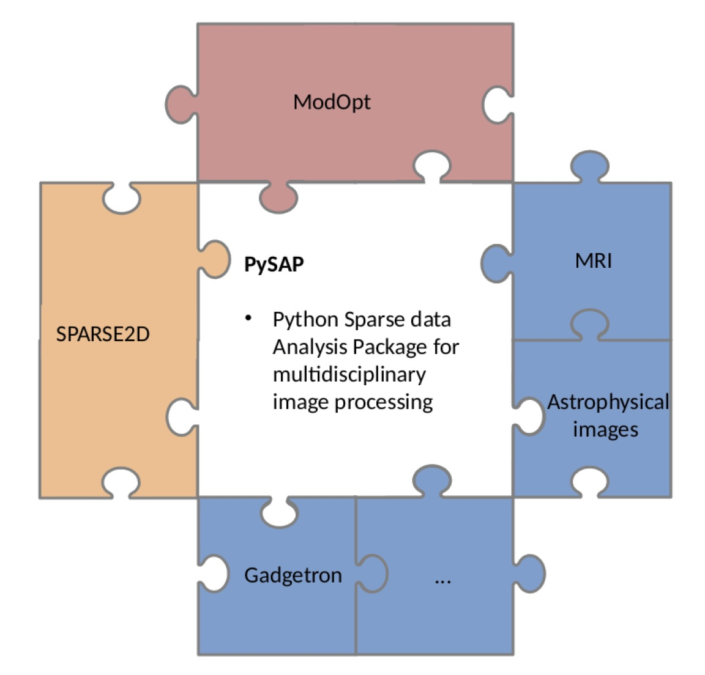

About
=====

.. figure:: ../images/cosmostat_logo.jpg
  :figclass: margin
  :width: 250px
  :alt: CosmoStat Logo
  :target: http://www.cosmostat.org/

.. figure:: ../images/neurospin_logo.png
  :figclass: margin
  :width: 250px
  :alt: NeuroSpin Logo
  :target: https://joliot.cea.fr/drf/joliot/en/Pages/research_entities/NeuroSpin.aspx

The Python Sparse data Analysis Package (PySAP) was developed
as part of |link-to-cosmic|, a multi-disciplinary collaboration between
|link-to-neurospin|, experts in biomedical imaging, and |link-to-cosmostat|,
experts in astrophysical image processing. The package was designed to provide
state-of-the-art signal processing tools for a variety of imaging domains such
as astronomy, electron tomography and magnetic resonance imaging (MRI). The
first release of PySAP was presented in :cite:`farrens:2020`.

Structure
---------

  Illustration of the structure of the PySAP package :cite:`farrens:2020`. The
  SPARSE2D and ModOpt core libraries are represented in orange and red,
  respectively. The various plug-in applications appear in blue.

PySAP is comprised of several core modules, namely:

- |link-to-sparse2d|: a collection of sparse image transforms written in C++
- |link-to-modopt|: a library of modular optimisation algorithms
- Application-specific plug-ins

PySAP provides python bindings to the C++ libraries, shared tools and a common
interface for all of the plug-ins.

Plug-ins
--------

PySAP plug-ins are application-specific tools designed for a given imaging
domain. Plug-ins combine ModOpt algorithms with image transforms to solve
complex inverse problems.

.. note::
  :class: margin

  New plug-ins can be developed using the PySAP |link-to-template|.

The plug-ins currently available in PySAP are:

- `PySAP-Astro <astro.html>`_: astrophysical image processing
- `PySAP-ETomo <etomo.html>`_: electron tomography image processing
- `PySAP-MRI <mri.html>`_: magnetic resonance image processing

Contributors
------------

You can find a |link-to-contributors|.

.. |link-to-cosmic| raw:: html

  <a href="http://cosmic.cosmostat.org/" target="_blank">COSMIC</a>

.. |link-to-neurospin| raw:: html

  <a href="https://joliot.cea.fr/drf/joliot/en/Pages/research_entities/NeuroSpin.aspx"
  target="_blank">NeuroSpin</a>

.. |link-to-cosmostat| raw:: html

  <a href="http://www.cosmostat.org/"
  target="_blank">CosmoStat</a>

.. |link-to-sparse2d| raw:: html

  <a href="https://github.com/CosmoStat/Sparse2D"
  target="_blank">Sparse2D</a>

.. |link-to-modopt| raw:: html

  <a href="https://cea-cosmic.github.io/ModOpt"
  target="_blank">ModOpt</a>

.. |link-to-template| raw:: html

  <a href="https://github.com/CEA-COSMIC/pysap-extplugin"
  target="_blank">plug-in template</a>

.. |link-to-contributors| raw:: html

  <a href="https://github.com/CEA-COSMIC/pysap/graphs/contributors"
  target="_blank">list of PySAP contributors here</a>
