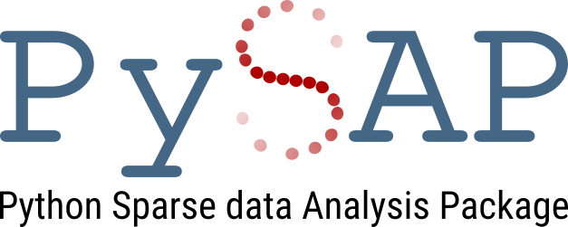
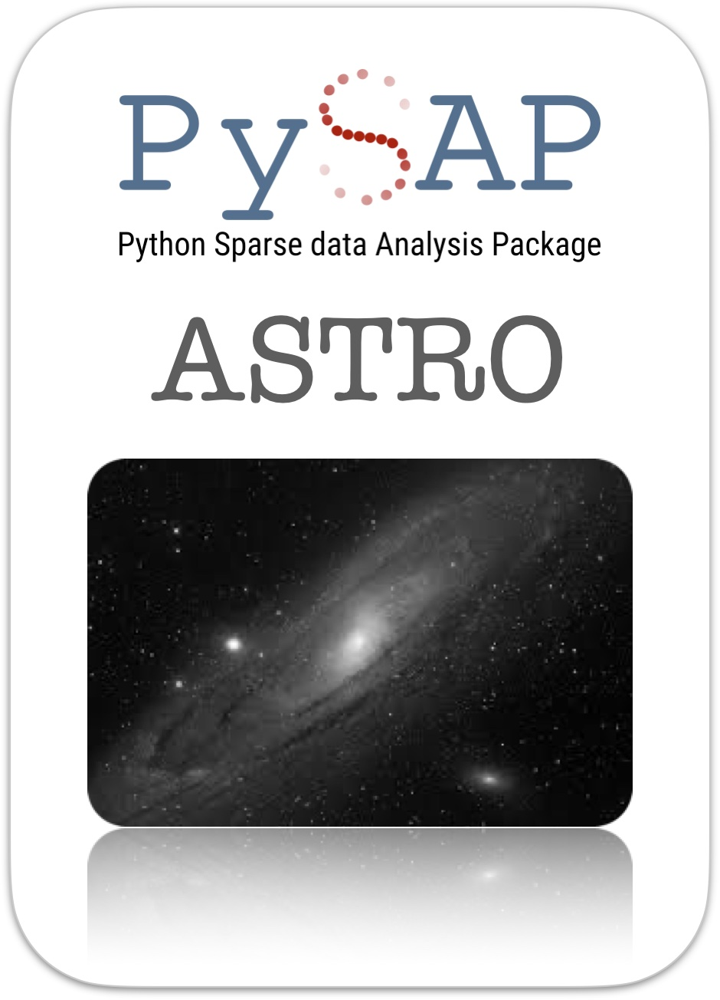
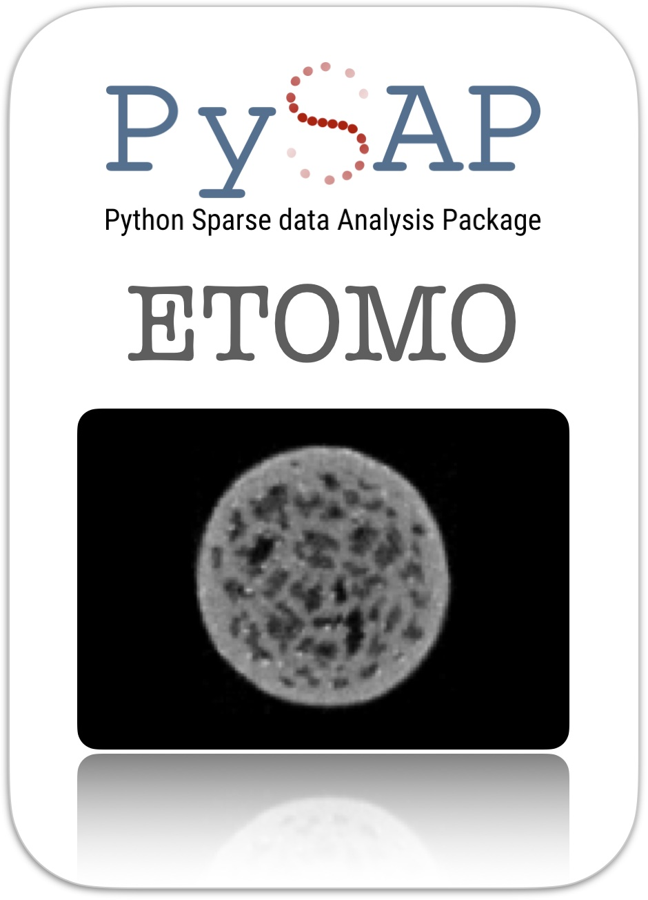

.. PySAP logo

.. PySAP badges
.. compound::
  :class: full-width

  .. centered:: |CI|_ |Codecov|_ |PyPi|_ |Docker|_ |arxiv|_

.. Include table of contents
.. include:: toc.rst

.. Blank line
|

.. Basic info
PySAP
=====

.. topic:: Latest release
  :class: full-width

  :Author: The PySAP Team
  :Version: |link-to-pypi|
  :Tag: |link-to-tag|
  :Release Date: 18/01/2022
  :Repository: |link-to-repo|

.. |link-to-pypi| raw:: html

  <a href="https://pypi.org/project/python-PySAP/0.0.6/"
  target="_blank">0.0.6</a>

.. |link-to-tag| raw:: html

  <a href="https://github.com/CEA-COSMIC/pysap/releases/tag/v0.0.6"
  target="_blank">v0.0.6</a>

.. |link-to-repo| raw:: html

  <a href="https://github.com/CEA-COSMIC/pysap"
  target="_blank">github.com/CEA-COSMIC/pysap</a>

.. Blank line
|

.. PySAP plug-ins

.. rubric:: PySAP Plug-ins
  :class: full-width

.. compound::
  :class: full-width

  .. centered:: |pysap-astro-image| |blank-space| |pysap-etomo-image| |blank-space| |pysap-mri-image|

.. |blank-space| raw:: html

  &nbsp;&nbsp;&nbsp;&nbsp;&nbsp;&nbsp;&nbsp;

.. seealso::
  :class: full-width

  See our gallery of `examples <auto_examples/index.html>`_ for specific
  applications of PySAP.

.. Blank line
|

.. PySAP badge links
.. |CI| image:: https://github.com/CEA-COSMIC/pysap/workflows/CI/badge.svg
.. _CI: https://github.com/CEA-COSMIC/pysap/actions?query=workflow%3ACI

.. |Codecov| image:: https://codecov.io/gh/CEA-COSMIC/pysap/branch/master/graph/badge.svg?token=XHJIQXV7AX
.. _Codecov: https://codecov.io/gh/CEA-COSMIC/pysap

.. |PyPi| image:: https://badge.fury.io/py/python-pySAP.svg
.. _PyPi: https://badge.fury.io/py/python-pySAP

.. |Docker| image:: https://img.shields.io/docker/cloud/build/ceacosmic/pysap
.. _Docker: https://hub.docker.com/r/ceacosmic/pysap

.. |arxiv| image:: https://img.shields.io/badge/arXiv-1910.08465-%23b31b1c
.. _arxiv: https://arxiv.org/abs/1910.08465
